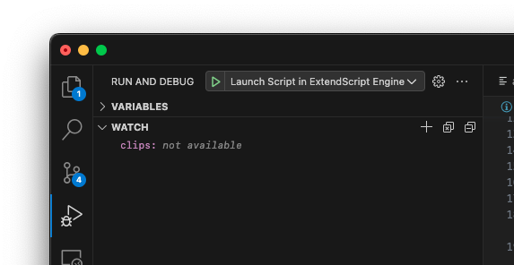

# RS Extract-fx

## What is it for?
*RS Extract-fx* is a Premiere Pro plugin that automates mass moving video effects to 'adjustment layers' just above the clip. This is especially useful while prepping for color grading in programs like Davinci Resolve. Once reimported, the effects can be restored by placing the processed footage under the generated adjustment layers. 

## What effects are supported?
- `Motion`-effects (position, scale, rotation etc.)
- Other video effects from the `effects`-panel.

> While supported, it is recommended to exclude Warp Stabilizer and Lumetri Color.

## Controls

## 

- **Source track**: select the video track you would like to extract effects from. Make sure you've simplified your footage to one video track.
- **Remove effects from source clips**: removes all attributes from the original video clips after the effects have been copied.
- **Back-up original sequence:** duplicates the current sequence before processing. This enables you te revert to your original sequence in case an error occurs.
- `Extract`-button: this button starts the copying process.
- `?`-button: Help-button that opens the plugin's manual. 

## Getting started
### Requirements
- Mac/PC 
- Adobe Premiere Pro with a test sequence (An arbitrary image sequence with effects dragged onto them will suffice).
- Yarn/NPM
- Visual Studio Code with the [ExtendScript Debugger](https://marketplace.visualstudio.com/items?itemName=Adobe.extendscript-debug).

### Getting started
1. Install the [ExtendScript Debugger](https://marketplace.visualstudio.com/items?itemName=Adobe.extendscript-debug) in visual studio code
2. Clone the repository and place the root folder into the Premiere extensions folder:
    - **Mac**: `/Library/Application Support/Adobe/CEP/extensions`;
    - **Win**: `C:/Program Files (x86)/Common Files/Adobe/CEP/extensions`
3. Allow non signed extensions to run:
    - **Mac**: In the terminal, type: `defaults write com.adobe.CSXS.8 PlayerDebugMode 1` 
      (The plist is also located at `/Users/<username>/Library/Preferences/com.adobe.CSXS.8.plist`)
    - **Win**: `regedit > HKEY_CURRENT_USER/Software/Adobe/CSXS.8`, then add a new entry `PlayerDebugMode` of type `string` with the value of `1`.
4. Open the root folder in VS Code and open your test sequence in Premiere. Open the extension panel by going to `Window > Extension > RS Extract-fx`.
5. run `yarn`/`npm` to download all dependencies.
6. Start the Typescript transpile pipelines
    1. **Extendscript backend**: `yarn dev-app`
    2. **Frontend**: `yarn dev-html`

7. Attatch VS code to Premiere by going to the debug tab and clicking the play button. You have the choice between two debug modes:
    - **Launch Script in Extendscript Engine**: works nice when trying to debug your extendscript code. With this mode you can run extendscript code directly in Premiere and also makes you able to inspect program variables and log messages, but you will only be able to execute your program via VS code.
    - **Attatch to Premiere:** great for debugging the frontend. gives access to console.log messages and a inspector at `localhost:7777` .
      
8. *Done* 🎉: you can find all the development files in the `src`-folders in the folders:
    1. Frontend: `dom_html/src`*;
    2. Backend: `dom_app/src;`

*Note: Typescript has no support for moving the html/css files to the dist folder. Therefore if you want to edit those kind of files you will have to edit them directly in `dom_html/dist/`. 

## Packaging and deployment

### Requirements
-   **The [ZXPSignCmd](https://github.com/Adobe-CEP/CEP-Resources/tree/master/ZXPSignCMD/4.0.7) signing utility**: creates signed .zxp bundles for Add-Ons or direct distribution.
    
-   **Utility for testing installation:**
    -   [ExManCmd](https://www.adobeexchange.com/resources/28) (command line)
    -   [ZXPinstaller](https://zxpinstaller.com/): (GUI)

### Instructions

You can either generate a self-signed certificate (ZXPSignCmd will make them for
you), or get one from a commercial security provider. Here's an example:

~~~~~~~~~~~~~~~~~~~~~~~~~~~~~~~~~~~~~~~~~~~~~~~~~~~~~~~~~~~~~~~~~~~~~~~~~~~~~~~~
./ZXPSignCmd -selfSignedCert US California Adobe "Bruce Bullis" password certificate.p12
~~~~~~~~~~~~~~~~~~~~~~~~~~~~~~~~~~~~~~~~~~~~~~~~~~~~~~~~~~~~~~~~~~~~~~~~~~~~~~~~

To sign directory `/PanelDir` with `certificate.p12`, do the following:

~~~~~~~~~~~~~~~~~~~~~~~~~~~~~~~~~~~~~~~~~~~~~~~~~~~~~~~~~~~~~~~~~~~~~~~~~~~~~~~~
./ZXPSignCmd -sign panelDir/ PanelName.zxp certificate.p12 password -tsa https://timestamp.geotrust.com/tsa
~~~~~~~~~~~~~~~~~~~~~~~~~~~~~~~~~~~~~~~~~~~~~~~~~~~~~~~~~~~~~~~~~~~~~~~~~~~~~~~~

Submit your panel to the [Adobe Add-Ons site](https://www.adobeexchange.com/producer) for approval, and distribution. You can also directly supply the .zxp file enterprise customers, and those who do not connect their systems to the public internet, for installation using [ExManCmd](https://www.adobeexchange.com/resources/28), the command line version of Extension Manager.
