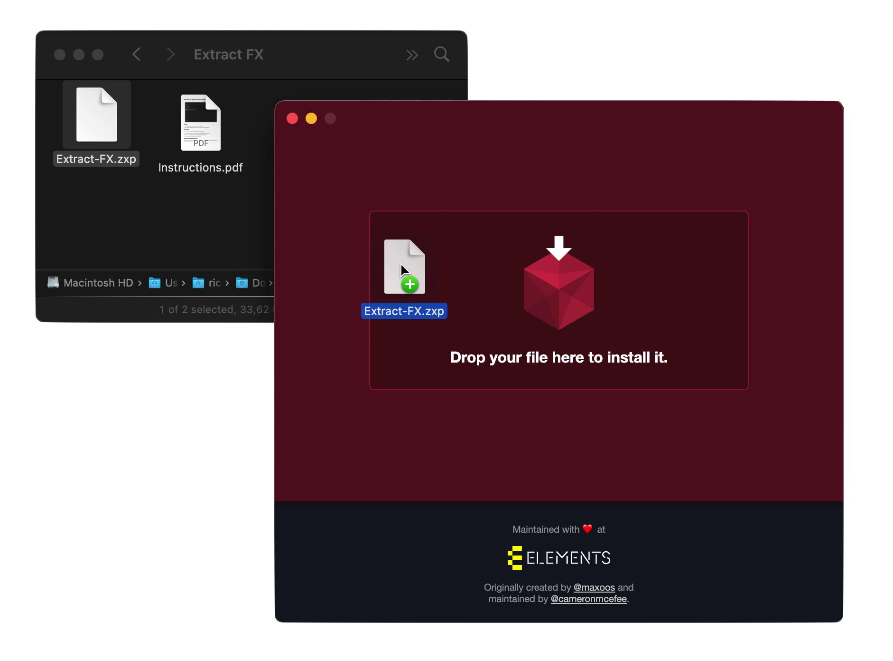

##### RS Extract FX

# 🚀 Get started

## Installation instructions

1. Download and install ZXPInstaller from [zxpinstaller.com](https://zxpinstaller.com/).
2. After opening ZXPInstaller, drag the file `Extract-FX.zxp` into the program.

## Uninstall Instructions

1. Go to your Premiere extensions folder at the following path:

- Windows: `C:/Program Files (x86)/Common Files/Adobe/CEP/extensions`;
- MacOS: ``/Library/Application Support/Adobe/CEP/extensions``

2. Delete the folder `space.therichard.ExtractFX`

## Help & troubleshooting

If any errors occur: click the `?`-button in the plugin to view instructions and common problems. Bugs and other issues can be sent to `support@therichard.space`.