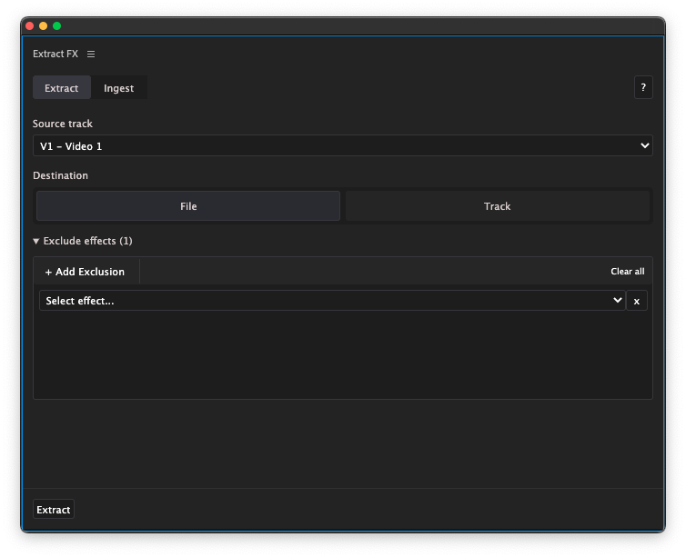
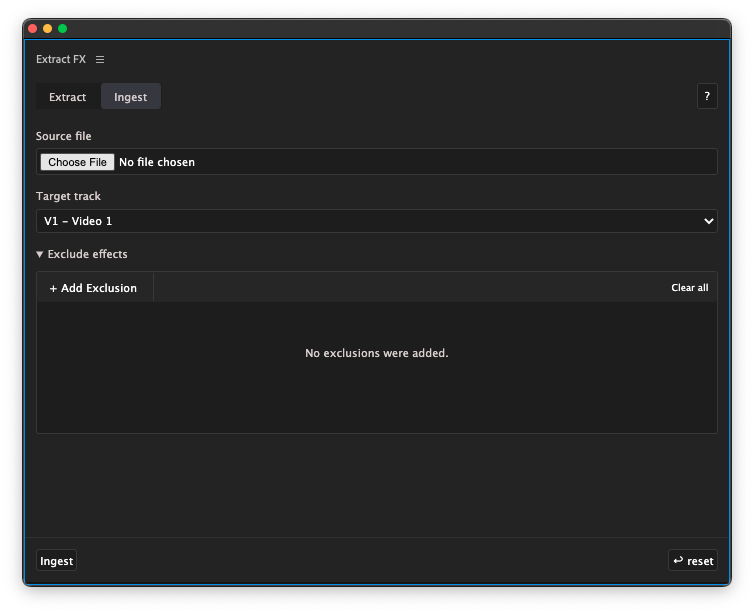

# RS Extract-fx

*RS Extract-fx* is a Premiere Pro plugin that automates backing up clip effects using adjustment layers or an external file. This is especially useful when prepping your sequence for color grading in programs like Davinci Resolve to make sure that effects don't change during the roundtrip. 

<video style="width: 100%" playsinline autoplay muted loop src="track.webm"></video>

[TOC]

## What effects are supported?

- Motion-effects (position, scale, rotation etc.);
- Other video effects from the `effects`-panel
## Limitations.
- Transitions and audio effects are not supported.
- Opacity is not supported in 'track'-mode
- It is recommended to exclude Warp stabilizer and Lumetri in track-mode.
## Controls

#### Extract-panel

Use this panel to back-up you clip effects

- **Source track**: select the video track you would like to extract effects from. Make sure you've simplified your footage to one video track. Make sure you flattened your timeline before extracting clip effects.
- **Destination**: choose the backup method
  - **File**: save all video effects of a track to an external json-file. Choose this option for the greatest compactibility.
  - **Track**: save all effects to your sequence by copying all clip effects to adjustment layers just above the clips. Choose this option if you want the ability to visually check if the effect were saved correctly.  This option does not support opacity.
- **Exclude effects**: Exclude certain effects from being backed up.
  - **Add exclusion**: Add a new effect you'd like to exclude.
  - **Clear All**: delete all exclusions.
  - **Select effect**: select the effect you'd like to exclude.
  - **X**: delete exclusion.

- `Extract`-button: this button starts the copying process.
- `?`-button: Help-button that opens the plugin's manual. 

#### Ingest-panel

Use this panel to restore your clip effects using the file that you created on the Extract-panel in 'file'-mode.

- **Source file**: select the file you created on the extract-page to back up your clip effects to.
- **Target track**: choose the track that the clips live on that you want to restore your effects to.

- **Exclude effects**: Exclude certain effects from being backed up. Controls are the same as on the extract-panel with the difference that you can only add exclusions for effects that are really in use for this timeline.

- `Extract`-button: this button starts the copying process.
- `?`-button: Help-button that opens the plugin's manual. 

## Troubleshooting

<ul >
	<li class="faq-item" id="custom-container">
    <b>How can I manually create an adjustmennt layer template with custom settings (resolution, framerate etc.)? </b> 
    Create a new adjustment layer called <code>RSFX-container</code> at the root of your project with the specs of your choosing. Make sure to also delete or rename all other files using this name.
	</li>  
  <li class="faq-item">
    <b>The created adjustment layers overlap clips on the track above the source track.</b> 
    Manually append a video track to the source track and run the program again.
	</li>  
</ul>

A project by [Richard van 't Hof](https://therichard.space)
