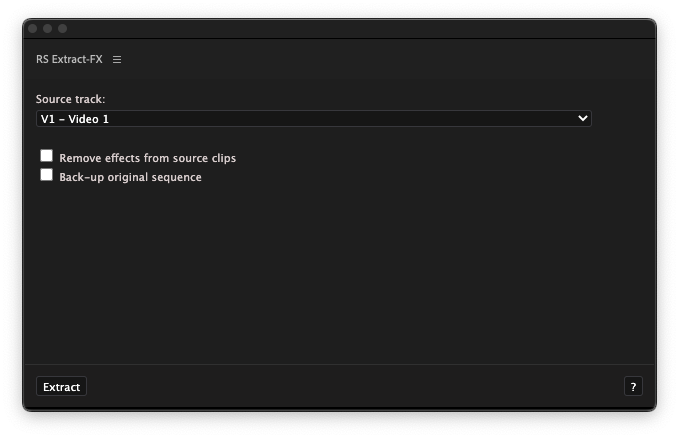

# RS Extract-fx

s*RS Extract-fx* is a Premiere Pro plugin that automates mass moving video effects to  'adjustment layers' just above the clip. This is especially useful while prepping your sequennce for color grading in programs like Davinci Resolve. Once reimported, the effects can be restored by placing the processed footage under the generated adjustment layers. This makes sure that no effect data is lost due to translation errors during the roundtrip.

<video src="preview.webm" loop autoplay></video>

[TOC]

## What effects are supported?

- Other video effects from the `effects`-panel
- `Motion`-effects (position, scale, rotation etc.)
## Not supported
- Transitions, opacity and audio effects are not supported.
-  Lumetri Color and Warp Stabiliser are not recommended due to performance reasons and majorly reduced usability due to the nature of adjustment layers.
## Controls

- **Source track**: select the video track you would like to extract effects from. Make sure you've simplified your footage to one video track.
- **Remove effects from source clips**: removes all attributes from the original video clips after the effects have been copied.
- **Back-up original sequence:** duplicates the current sequence before processing. This enables you te revert to your original sequence in case an error occurs.
- `Extract`-button: this button starts the copying process.
- `?`-button: Help-button that opens the plugin's manual. 

## Troubleshooting

<ul >
	<li class="faq-item" id="custom-container">
    <b>Can I create an adjustmennt layer template using custom properties? (resolution, framerate etc.)</b> 
    Yes, manually create a new adjustment layer called <code>RSFX-container</code> at the root of your project with the specs of your choosing. Make sure to also delete or rename all other files using this name.
	</li>  
  <li class="faq-item">
    <b>The created adjustment layers overlap clips on the track above the source track.</b> 
    Manually append a video track to the source track and rerun the program.
	</li>  
  <li class="faq-item">
    <b>My keyframes are not placed at the correct timecode.</b> 
		<ul>
      <li>Make sure that your sequence's start time is the timecode <code>00:00:00:00</code>.</li>
      <li>Make sure that the <code>RSFX-container</code> has the same framerate as your sequence. <a href="#custom-container">Create a custom RSFX-container</a> if this is not the case.</li>
		</ul>
	</li>  
</ul>

A project by [Richard van 't Hof](https://therichard.space)
